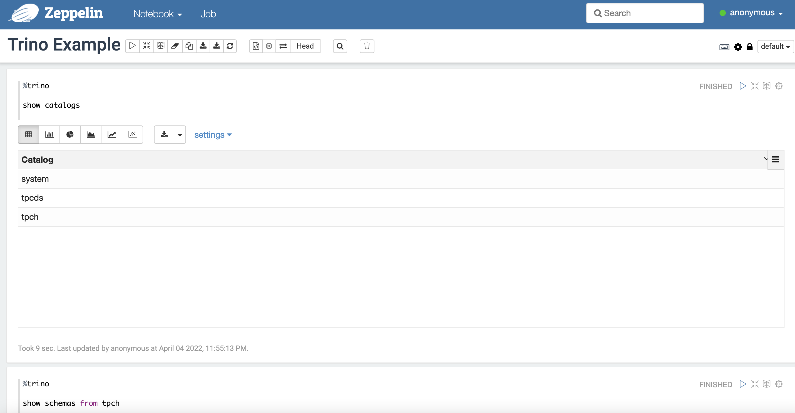

# Introduction

This is docker-compose tutorial for querying Trino via [Apache Zeppelin](https://zeppelin.apache.org/)

# How to use

## Step 1

Run the following command to download Trino jdbc driver

```
./download_driver.sh
```

## Step 2

Run the following command to start Trino & Zeppelin in docker container
```
docker-compose up -d 
``` 

## Step 3

Open http://localhost:8082 in your browser, and open `Trino Example` notebook, then you can run Trino query like trino-cli.


