# DolphinScheduler Example

This is an example of [DolphinScheduler](https://dolphinscheduler.apache.org/en-us)
and Trino, we run these two services with docker compose, create a simple workflow
in DolphinScheduler, and then add an example about combining with Trino job.

> NOTE: DolphinScheduler with native Trino support is not released yet so in this example
> we use the unofficial DolphinScheduler Docker image from
> [zhongjiajie/dolphinscheduler-standalone-server](https://hub.docker.com/repository/docker/zhongjiajie/dolphinscheduler-standalone-server/general).
> When DolphinScheduler version 3.2.0 is released, you can replace the official Docker image
> by modifying `.env` in the current directory. `HUB` and `TAG` parameters should be changed.

## Goals

In this tutorial, you will:

1. Learn the basic usage of DolphinScheduler and run a simple workflow.
2. How to run Trino job in DolphinScheduler.

## Steps

### Running Services

First, you want to start the services. Make sure that you are in the
`trino-getting-started/dolphinscheduler` directory. Now run the following
command:

```shell
# clone this repo source code, and go to dolphinscheduler directory
git clone git@github.com:bitsondatadev/trino-getting-started.git
cd trino-getting-started/dolphinscheduler

# start the services
docker-compose up -d
```

You should expect to see the following output (maybe will take some time to
download the docker images):

```shell
[+] Running 2/2
 * Container dolphinscheduler-trino-coordinator-1  Started                                                                                                                                                                                                                                                                                                                     0.6s
 * Container dolphinscheduler-dolphinscheduler-1   Started
```

### Checking Services Status

You can check the status of the services by running the following command:

```shell
docker-compose ps
```

You should expect to see the following output when you see the status of
both Trino and DolphinScheduler are `running (healthy)`, which means the services
are ready to use.

```shell
NAME                                   COMMAND                  SERVICE             STATUS              PORTS
dolphinscheduler-dolphinscheduler-1    "/bin/bash ./bin/sta…"   dolphinscheduler    running (healthy)   0.0.0.0:12345->12345/tcp, :::12345->12345/tcp, 0.0.0.0:25333->25333/tcp, :::25333->25333/tcp
dolphinscheduler-trino-coordinator-1   "/usr/lib/trino/bin/…"   trino-coordinator   running (healthy)   0.0.0.0:8080->8080/tcp, :::8080->8080/tcp
```

### Run A Simple Workflow With DolphinScheduler

You can log in dolphinscheduler with http://localhost:12345/dolphinscheduler/ui,
the default username/password is `admin/dolphinscheduler123`.

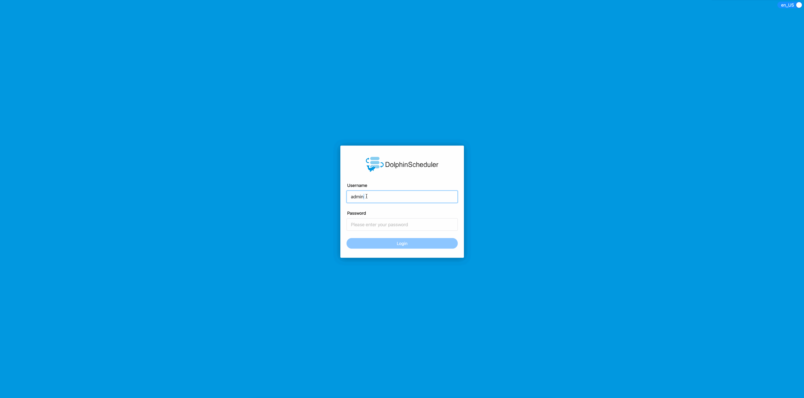

#### Create Tenant

Tenant is a concept that cannot be bypassed while using DolphinScheduler, so
let's briefly introduce the concept of tenant first.

The account named `admin` logged into DolphinScheduler is called user in dolphinscheduler.
To better control system resources, DolphinScheduler introduce the concept of
tenants, which are used to execute tasks.

The brief is as follows:

* User: login web UI, do all operations in the web UI, including workflow management and tenant creation.
* Tenant: the actual executor of the task, A Linux user for DolphinScheduler worker.

We can create a tenant in DolphinScheduler `Security -> Tenant Manage` page.

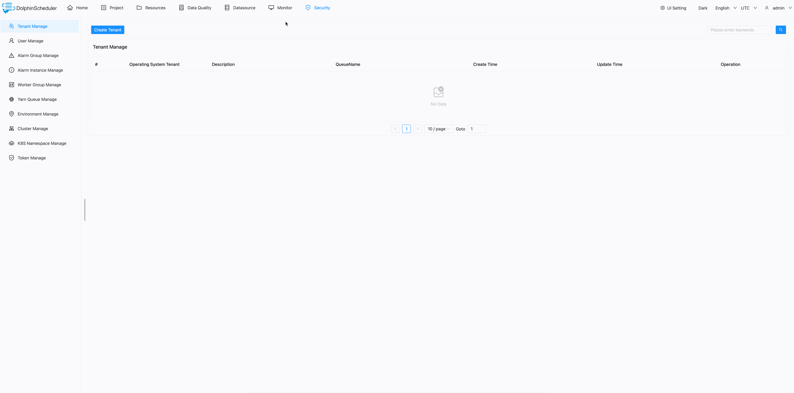

#### Assign Tenant to User

As we talked about above in [Create Tenant](#create-tenant), the user can only run the task
unless the user is assigned to a tenant.

We can assign a tenant to a specific user in DolphinScheduler `Security -> User Manage` page.

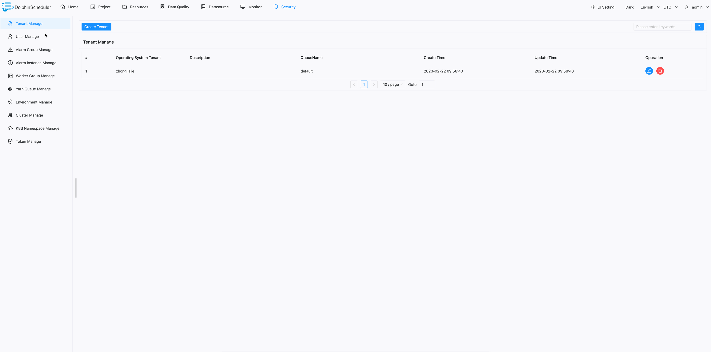

#### Create and Run Workflow

After we create a tenant and assign it to a user, we can start creating a
simple workflow in DolphinScheduler.

##### Create Project

But in DolphinScheduler, all workflow must belong to a project, so we need
to create a project first.

We can create a project in DolphinScheduler `Project` page by clicking
`Create Project` button.

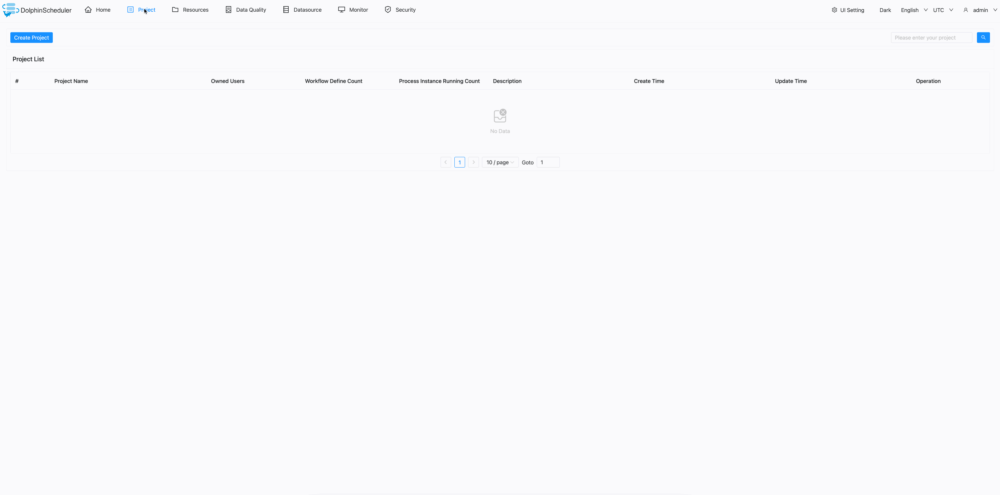

##### Create Workflow

Now we can create a workflow for the project `tutorial`. Click the project we just created,
go to `Workflow Definition` page, click `Create Workflow` button, and we will redirect
to the workflow detail page.

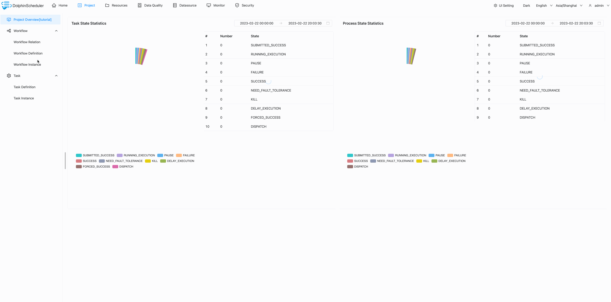

##### Create Tasks

We can use the mouse to drag the task you want to create from the toolbar in the workflow canvas.
In this case, we create a `Shell` task. Entering the necessary information for the task,
we just fill the attribute `Node Name` with `Script` to the task for this simple workflow.
After that, we can click the `Save` button save the task into the workflow. We create another task
using the same way.

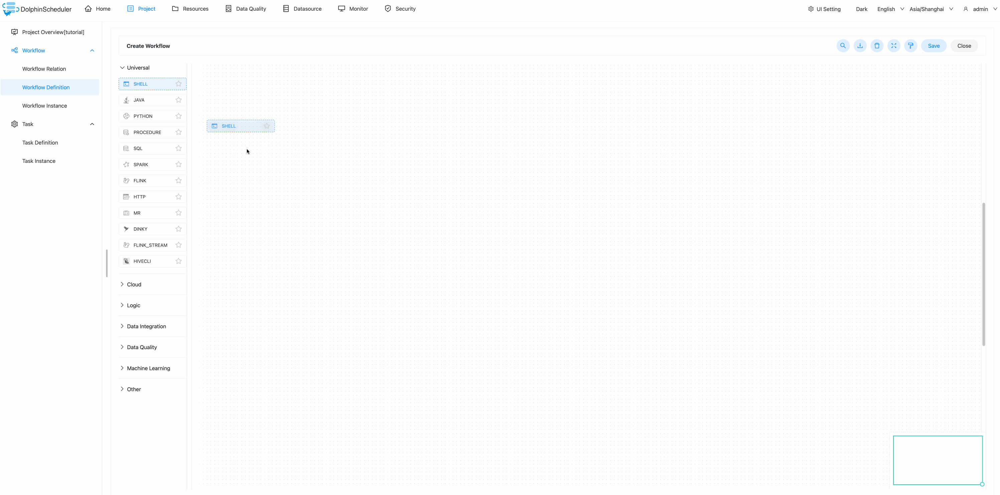

##### Set Task Dependency

So we have two different tasks with different names and commands to run in the workflow. The
only thing missing from the current workflow is task dependency. We can add dependency using
the mouse to drag the arrow from the upstream task to the downstream and then release the mouse.
And you can see the link with the arrow between the two tasks is created, from the upstream
task to the downstream one. Finally, we can click the `Save` button from the top right corner
to save the workflow, do not forget to fill name of the workflow.

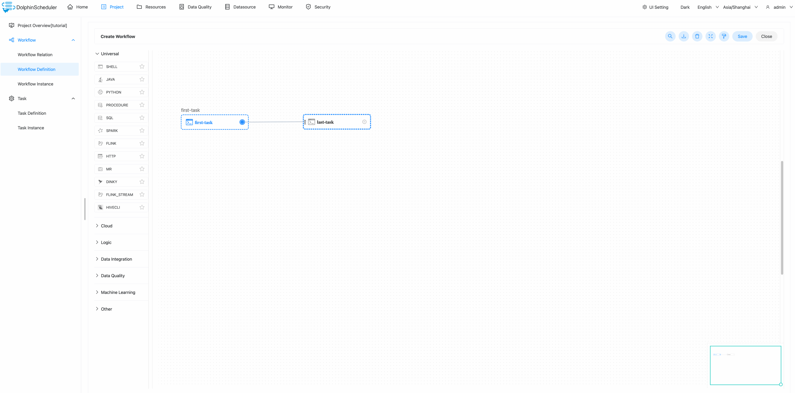

##### Run Workflow

After all done, we can run the workflow by clicking the `Online` and then the `Run` button from
the workflows list. If you want to see the workflow instance, just go to `Workflow Instance`
page, you can see the workflow instance is running and the status is `Executing`.

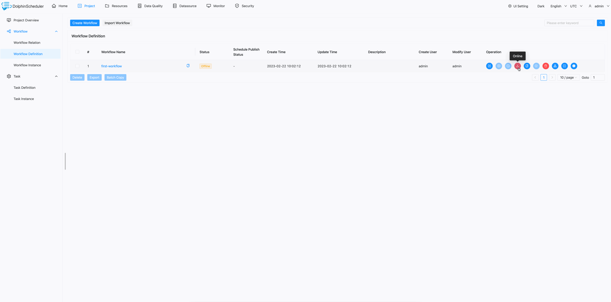

##### View Log

If you want to view the task log, please click the workflow instance from the workflow instance
list, then find the task you want to view the log, right-click the mouse and select `View Log`
from the context dialog, and you can see the detailed log of the task.

You can the task print the `Hello DolphinScheduler` and `Ending...` which is the same as we
define [in the task](#create-tasks).

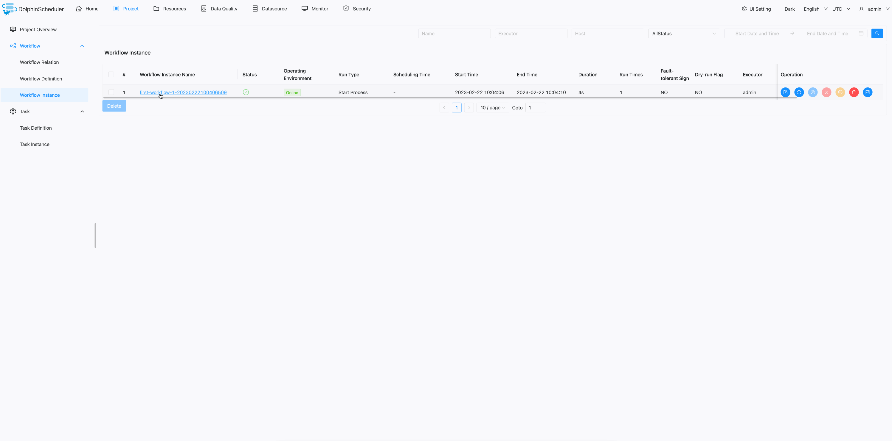

You just finished the first tutorial of DolphinScheduler, you can now run some simple workflow
in DolphinScheduler, congratulations!

### Run Trino Task in DolphinScheduler

A module named `Datasource` in DolphinScheduler is for managing all database connection information.
In this section, we will use it to create and manage Trino datasource.

#### Create Datasource

To separate the development and production environments, DolphinScheduler needs to create a
test data source before we create the production one. If you do not use the development environment,
you can just make development and production datasource in the same. And in this tutorial we will also
do that.

Create a development one first, by clicking `Create Datasource` button in `Datasource` page, and fill
the necessary information, and then click `Save` button to save the development datasource. And the
production one follows the same way to create, but when you select the production button, DolphinScheduler
will ask you to connect the exists development datasource, we can select the datasource we just created
and click `Save` button to save the production datasource.

And for the detailed information of this tutorial is as follows:

```json
{
  "Datasource Name": "trino-test",
  "IP": "127.0.0.1",
  "Port": "8080",
  "User Name": "admin",
  "Database Name": "tpch"
}
```

please remember to change the `Datasource Name` to `trino-prod` when you create the production datasource.

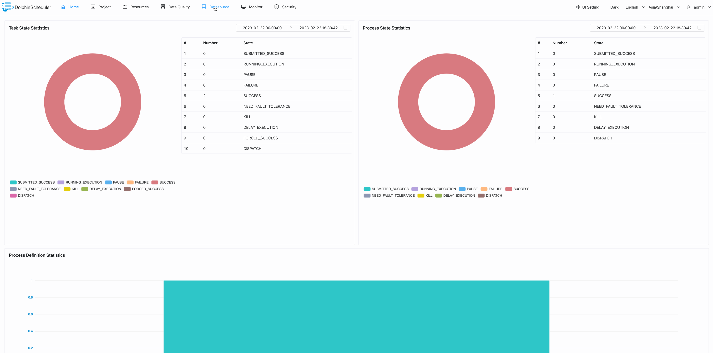

#### Use Datasource in SQL Task

After we create the production datasource, we can use it in the SQL task. We can create the task just
like we create the shell task in [create task](#create-tasks) section. But we need to drag the SQL type
instead of the shell type. The parameter of the SQL task is a little different from the shell task,
expect the `Node Name` and `SQL Statement`, we also need to select the `Datasource Type` and
`Datasource Instance` before we save it.

In this tutorial, we query the `customer` table in `tpch` catalog and `tiny` database, the SQL statement
is as follows:

```sql
SELECT * FROM tpch.tiny.customer LIMIT 10
```

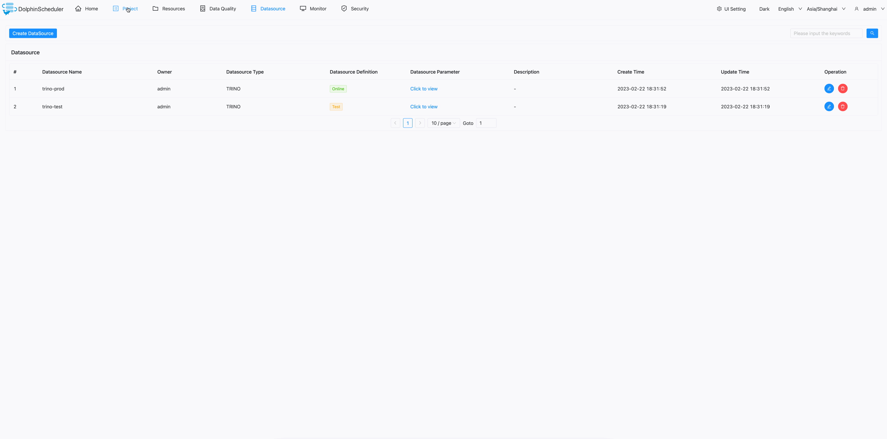

#### Run Workflow with SQL Task

The step run workflow with SQL task is the same as [run workflow](#run-workflow) section, and we can follow
[view log](#view-log) section to view the log of the SQL task.

In this case, we can see the top 10 records of the `customer` table in the log, the detail is:

```log
display sql result 10 rows as follows:
row 1 : {"custkey":1126,"name":"Customer#000001126","address":"8J bzLWboPqySAWPgHrl4IK4roBvb","nationkey":8,"phone":"18-898-994-6389","acctbal":3905.97,"mktsegment":"AUTOMOBILE","comment":"se carefully asymptotes. unusual accounts use slyly deposits; slyly regular pi"}
row 2 : {"custkey":1127,"name":"Customer#000001127","address":"nq1w3VhKie4I3ZquEIZuz1 5CWn","nationkey":10,"phone":"20-830-875-6204","acctbal":8631.35,"mktsegment":"AUTOMOBILE","comment":"endencies. express instructions wake about th"}
row 3 : {"custkey":1128,"name":"Customer#000001128","address":"72XUL0qb4,NLmfyrtzyJlR0eP","nationkey":0,"phone":"10-392-200-8982","acctbal":8123.99,"mktsegment":"BUILDING","comment":"odolites according to the regular courts detect quickly furiously pending foxes? unusual theodolites use p"}
row 4 : {"custkey":1129,"name":"Customer#000001129","address":"OMEqYv,hhyBAObDjIkoPL03BvuSRw02AuDPVoe","nationkey":8,"phone":"18-313-585-9420","acctbal":6020.02,"mktsegment":"HOUSEHOLD","comment":"pades affix realms. pending courts haggle slowly fluffily final requests. quickly silent deposits are. iro"}
row 5 : {"custkey":1130,"name":"Customer#000001130","address":"60zzrBpFXjvHzyv0WObH3h8LhYbOaRID58e","nationkey":22,"phone":"32-503-721-8203","acctbal":9519.36,"mktsegment":"HOUSEHOLD","comment":"s requests nag silently carefully special warhorses. special accounts hinder slyly. fluffily enticing"}
row 6 : {"custkey":1131,"name":"Customer#000001131","address":"KVAvB1lwuN qHWDDPNckenmRGULDFduxYRSBXv","nationkey":20,"phone":"30-644-540-9044","acctbal":6019.1,"mktsegment":"MACHINERY","comment":"er the carefully dogged courts m"}
row 7 : {"custkey":1132,"name":"Customer#000001132","address":"6dcMOh60XVGcGYyEP","nationkey":22,"phone":"32-953-419-6880","acctbal":4962.12,"mktsegment":"AUTOMOBILE","comment":"ges. final, special requests nag carefully carefully bold deposits. ironic requests boost slyly through th"}
row 8 : {"custkey":1133,"name":"Customer#000001133","address":"FfA0o cMP02Ylzxtmbq8DCOq","nationkey":14,"phone":"24-858-762-2348","acctbal":5335.36,"mktsegment":"MACHINERY","comment":"g to the pending, ironic pinto beans. furiously blithe packages are fina"}
row 9 : {"custkey":1134,"name":"Customer#000001134","address":"79TYt94ty a","nationkey":9,"phone":"19-832-924-7391","acctbal":8458.26,"mktsegment":"HOUSEHOLD","comment":"riously across the bold instructions. quickly "}
row 10 : {"custkey":1135,"name":"Customer#000001135","address":"cONv9cxslXOefPzhUQbGnMeRNKL1x,m2zlVOj","nationkey":11,"phone":"21-517-852-3282","acctbal":3061.78,"mktsegment":"FURNITURE","comment":"regular frays about the bold, regular requests use quickly even pin"}
```


And that is a simple tutorial on how to use the Trino task in DolphinScheduler.

### Stopping Services

Once you complete this tutorial, the resources used for this exercise can be released
by running the following command:

```shell
docker-compose down
```

You should expect to see the following output

```shell
[+] Running 3/3
* Container dolphinscheduler-trino-coordinator-1  Removed                                                                                                                                                                                                                                                                                                                     0.0s
* Container dolphinscheduler-dolphinscheduler-1   Removed                                                                                                                                                                                                                                                                                                                    10.3s
* Network dolphinscheduler_trino-network          Removed
```
