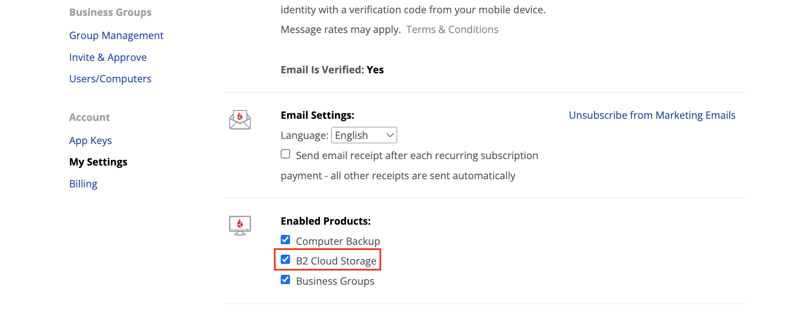
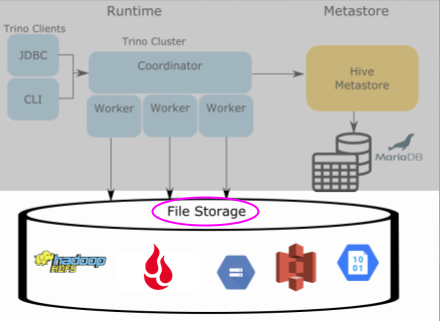
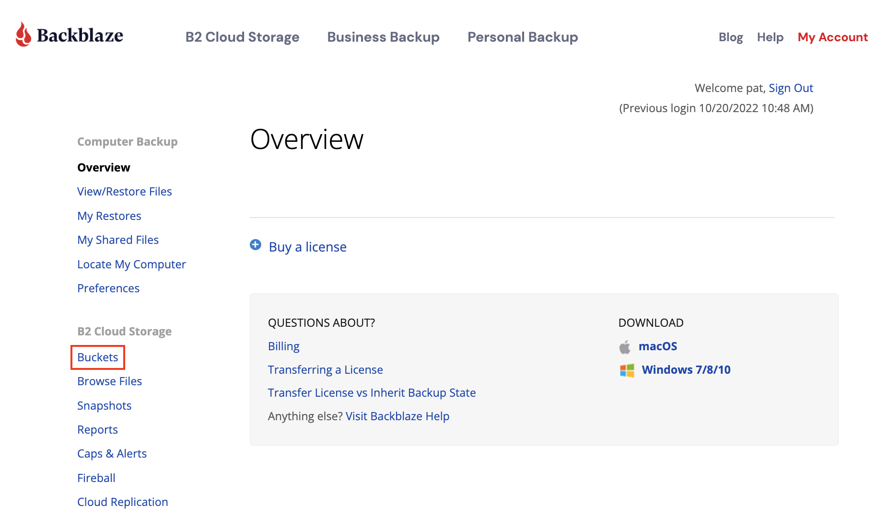
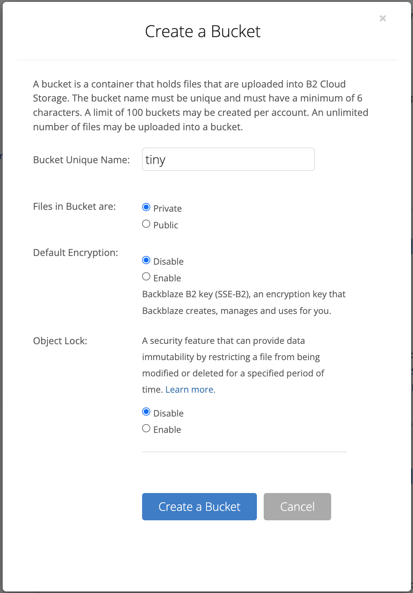
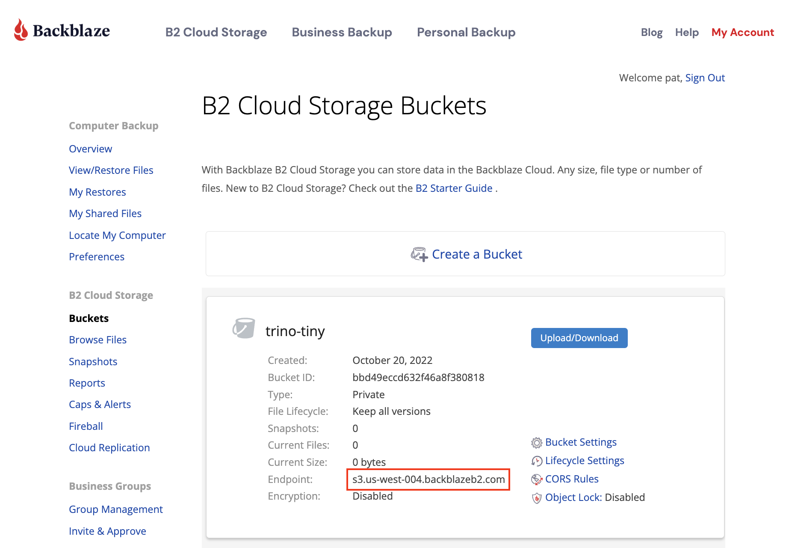
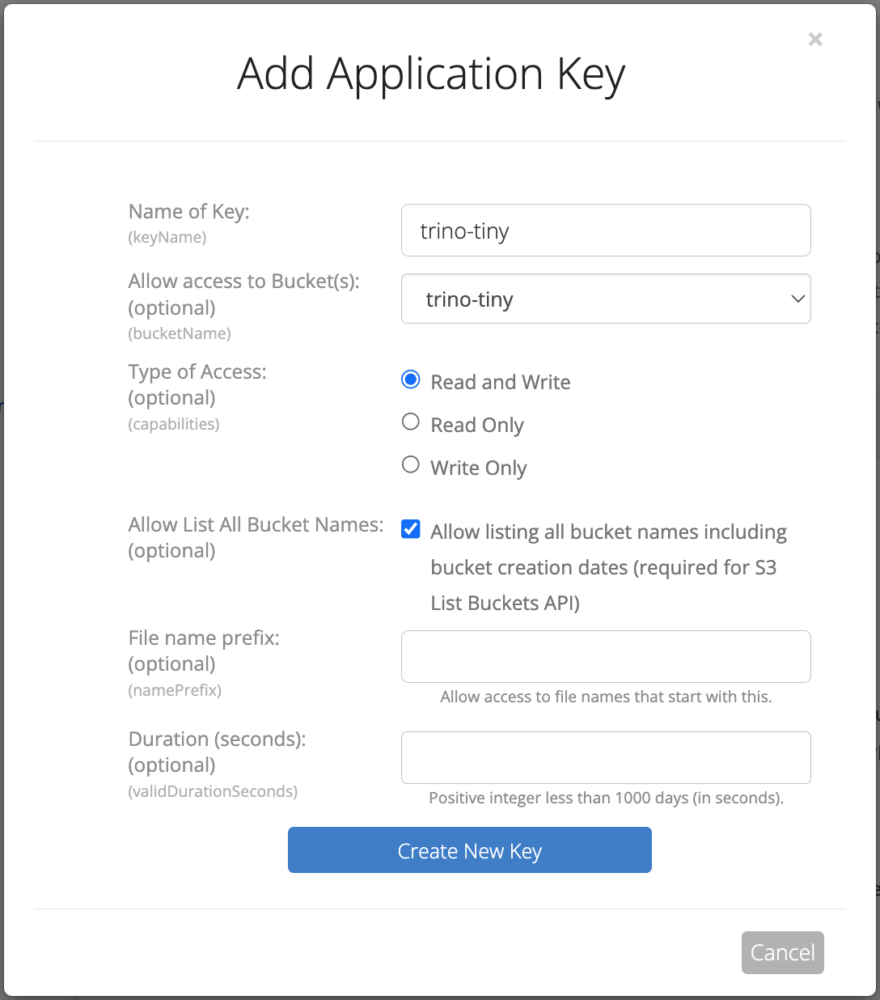
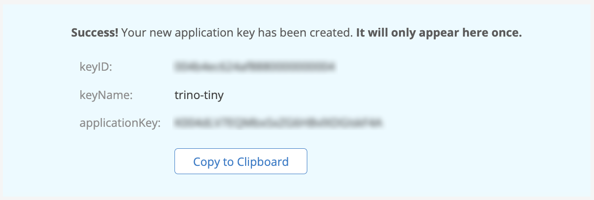
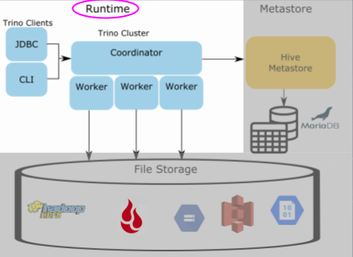
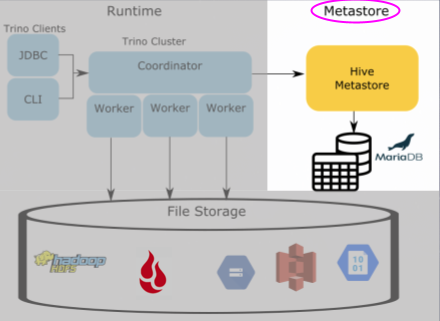

# Hive Connector over Backblaze B2 Cloud Storage

This tutorial is closely based on the [trino-minio](../trino-minio) tutorial by [bitsondatadev](/bitsondatadev). In this version of the tutorial, you will configure Trino to use [Backblaze B2 Cloud Storage](https://www.backblaze.com/b2/cloud-storage.html) for file storage.

## Introduction 
If you are new to Trino or Presto®, I recommend that you check out the following
blog to get a sense for the Hive connector architecture. [A gentle
 introduction to the Hive connector](https://trino.io/blog/2020/10/20/intro-to-hive-connector.html)

## Goals
In this tutorial, you will:
 1. Learn how to run a CTAS (CREATE TABLE AS) statement in Trino.
 2. Learn the roles of the Trino runtime, metastore, and storage.
 3. Dive into the relational database that contains the Hive model and metadata that is stored in the Hive metastore service.
 4. Run SQL queries against the real-world [Backblaze Drive Stats](https://www.backblaze.com/b2/hard-drive-test-data.html) public data set.

## Steps

### Running Services

First, you want to start the services. Make sure that you are in the 
`trino-getting-started/hive/trino-b2` directory. Now run the following
command:

```
docker-compose up -d
```

You should expect to see the following output (you may also have to download
the Docker images before you see the "done" message):

```
[+] Running 4/4
 ⠿ Network trino-b2_trino-network          Created  0.0s
 ⠿ Container trino-b2-mariadb-1            Started  0.6s
 ⠿ Container trino-b2-trino-coordinator-1  Started  0.6s
 ⠿ Container trino-b2-hive-metastore-1     Started  0.7s
```

### Open Trino CLI

Once this is complete, you can log into the Trino coordinator node. We will
do this by using the [`exec`](https://docs.docker.com/engine/reference/commandline/exec/)
command and run the `trino` CLI executable as the command we run on that
container. Notice the container id is `trino-b2_trino-coordinator_1` so the
command you will run is:

```
docker container exec -it trino-b2-trino-coordinator-1 trino
```

When you start this step, you should see the `trino` cursor once the startup
is complete. It should look like this when it is done:
```
trino>
```
 
The first step to understanding the Hive metastore's role in the Hive
connector is to run a CTAS (CREATE TABLE AS) query that pushes data from one of
the TPC connectors into the hive catalog that points to Backblaze B2. The TPC
connectors generate data on the fly so that we can run simple tests like this.

First, run a command to show the catalogs to see the `tpch` and `b2` catalogs
since these are what we will use in the CTAS query.

```
SHOW CATALOGS;
```

You should see that the b2 catalog is registered. This is actually a Hive
connector configured under the name `b2` to delineate the underlying storage
we are using.

### Create a Backblaze Account

If you already have a Backblaze account with B2 enabled, you can skip to the next section.

<a name="enable-b2-existing-account"></a>
If you have a Backblaze account, but you don't see the **B2 Cloud Storage** menu on the left after you sign in, then you need to enable Backblaze B2 for your account. On the left, under Account, click **My Settings**, then, under Enabled Products, click the checkbox for **B2 Cloud Storage**.



The page will refresh and you will see the B2 Cloud Storage menu on the left.

If you do not yet have a Backblaze account, navigate to the [Backblaze B2 signup page](https://www.backblaze.com/b2/sign-up.html?referrer=nopref), enter your email address and a password, and click **Sign Up for Backblaze B2**. Your account includes 10 GB of storage free of charge, and you don't need to submit any credit card details until you need more.

### Create a Bucket in Backblaze B2

If we look at the Trino Architecture, we're first going to prep the file storage
where the actual data will reside. In earlier iterations of big data systems,
this layer was commonly HDFS or other S3 compatible storage and AWS S3. For our
example, we're using Backblaze B2, which is also S3 compatible. Creating a bucket gives
us a location to write our data to and we can tell Trino where to find it.



[Sign in to Backblaze B2](https://www.backblaze.com/user_signin.htm), and, in the **B2 Cloud Storage** menu on the left, click **Buckets**.



If you don't see the B2 Cloud Storage menu, you need to [enable B2 on your Backblaze account](#enable-b2-existing-account).

Click **Create a Bucket** and name the bucket `trino-tiny`, as the dataset we will be transferring will be small.



Leave the remaining settings with their defaults and click **Create a Bucket**. 

Make a note of the endpoint value in the bucket details; you'll need that to configure Trino in a moment.



### Create an Application Key in Backblaze B2

Now you have a bucket in Backblaze B2, you have to create an application key that Trino's Hive connector can use to access it. In the menu on the left, under **Account**, click **App Keys**, then click **Add a New Application Key**.

It's good practice to limit a key to access a single bucket if you can, so name the key `trino-tiny` and select `trino-tiny` in the **Allow Access to Bucket(s)** dropdown. Many tools require the ability to list all of the buckets in an account, even if they will only be using a single bucket, so enable **Allow List All Bucket Names**. Leave the remaining settings with their defaults and click **Create New Key**.



**IMPORTANT**: You MUST copy the application key immediately after you create it. You cannot access the key after you leave this page. Make a note of the key id as well as the application key.



### Configuring Trino

We need to configure Trino's Hive Connector to access the bucket in Backblaze B2. There are several edits across three configuration files, so, before you start, ensure you have the required information to hand. The configuration files contain the following placeholders:

* `BUCKET_NAME`
* `APPLICATION_KEY`  
* `KEY_ID`
* `ENDPOINT`

The `BUCKET_NAME` is `trino-tiny`; you should have a note of `APPLICATION_KEY`, `KEY_ID` and `ENDPOINT` from creating the bucket and application key earlier.

Edit each of the following three files and replace the placeholders with your values:

* `conf/core-site.xml`
* `conf/metastore-site.xml`
* `etc/catalog/b2.properties`

For example, in `conf/core-site.xml`, the first edit is to change

```xml
    <property>
        <name>fs.defaultFS</name>
        <value>s3a://BUCKET_NAME</value>
    </property>
```

to

```xml
    <property>
        <name>fs.defaultFS</name>
        <value>s3a://drivestats-parquet</value>
    </property>
```

Once you've completed editing the configuration files, save them, and restart Trino by running the following command from the `trino-getting-started/hive/trino-b2` directory:

```
docker compose restart trino-b2-trino-coordinator-1
```

You will also need to restart the Trino CLI:

```
docker container exec -it trino-b2-trino-coordinator-1 trino
```

### Querying Trino

Now that we've set up the Backblaze B2 bucket and application key, lets move to creating a SCHEMA that
points us to the bucket in Backblaze B2 and then run our CTAS query. When we create a
table using CTAS, we're telling the table to copy the table schema and the
data from the source table into the table we're creating. This will make more
sense when you see the query below.

Note: There are two meanings we just used when saying the word "schema".
There is the table schema that defines columns of a table, then there is the
SCHEMA that I intentionally put in all caps that signifies the SCHEMA in the
containment hierarchy used by Trino. Trino defines a CATALOG which contains
multiple SCHEMAS, which contain multiple TABLES. In other databases like
Hive and MySQL



Back in the terminal create the b2.tiny SCHEMA. This will be the first call
to the metastore to save the location of the S3 schema location in Backblaze B2.

```
CREATE SCHEMA b2.tiny
WITH (location = 's3a://trino-tiny/');
```

Now that we have a SCHEMA that references the bucket where we store our tables 
in Backblaze B2, we now can create our first table.

Optional: To view your queries run, log into the 
[Trino UI](http://localhost:8080) and log in using any username (it doesn't
 matter since no security is set up).

Move the customer data from the tiny generated tpch data into Backblaze B2 using a CTAS
query. Run the following query and if you like, watch it running on the Trino UI:

```
CREATE TABLE b2.tiny.customer
WITH (
    format = 'ORC',
    external_location = 's3a://trino-tiny/customer/'
) 
AS SELECT * FROM tpch.tiny.customer;
```

Go back to the [Backblaze B2 UI](https://secure.backblaze.com/b2_buckets.htm), and click the **Upload/Download** button for the `trino-tiny` bucket. You will now see a `customer` directory generated from that table and
underneath that directory will be a file with a name comprised of uuid and date.
This is the orc file generated by the Trino runtime residing in Backblaze B2.

Now there is a table under Backblaze B2, you can query this data by checking the
following.

```
SELECT * FROM b2.tiny.customer LIMIT 50;
```

So the question now is how does Trino know where to find the orc file residing
in Backblaze B2 when all we specify is the catalog, schema, and table? How does Trino
know what columns exist in the orc file, and even the file it is retrieving
is an orc file to being with? Find out more in the next step.

### Exploring the Hive Metastore



In order for Trino to know where to locate this file, it uses the Hive
metastore to manage and store this information or metadata in a relational
database that the metastore points to, in this case our `mariadb` instance.
Execute the following statement to log into the `mariadb` instance and follow
the remaining commands to learn how the metadata gets split into different
tables. Understanding this model will also solidify the metastore's role in the
scheme of Trino's use of it in the Hive connector.

Open another terminal and run the following command:

```
docker container exec -it "trino-b2_mariadb_1" /bin/bash
```

Once you see the `root@mariadb` terminal, enter into the cli.

```
mysql -uroot -p"$MYSQL_ROOT_PASSWORD"
```

Now that you're in the metastore's database command line interface, you can run 
SQL commands on this database to see where the metadata is stored. First, let's
look at the databases stored in the metastore.

```
SELECT
 DB_ID,
 DB_LOCATION_URI,
 NAME, 
 OWNER_NAME,
 OWNER_TYPE,
 CTLG_NAME
FROM metastore_db.DBS;
```

```
+-------+---------------------------+---------+------------+------------+-----------+
| DB_ID | DB_LOCATION_URI           | NAME    | OWNER_NAME | OWNER_TYPE | CTLG_NAME |
+-------+---------------------------+---------+------------+------------+-----------+
|     1 | file:/user/hive/warehouse | default | public     | ROLE       | hive      |
|     2 | s3a://trino-tiny/         | tiny    | trino      | USER       | hive      |
+-------+---------------------------+---------+------------+------------+-----------+
```
This shows the databases. What may be strange at first glance, is this is
showing the schema that we created under the database table. This is because
the Hive metastore has two abstractions for its metadata, databases and tables.
Since Trino follows the traditional 3 level ANSI SQL catalog standard, schema
is equivalent to a database. So just as a database contains multiple tables,
a schema will contain multiple tables. Notice the `DB_LOCATION_URI` is in the
bucket location created before in Backblaze B2 and set when you created this schema. 
The owner is the `trino` user coming from the user in the trino instance. Also
note the `CTLG_NAME` references the trino catalog.

The next command will show us metadata about the customer table created in the
previous step

```
SELECT 
 t.TBL_ID, 
 t.DB_ID, 
 t.OWNER, 
 t.TBL_NAME, 
 t.TBL_TYPE,
 t.SD_ID
FROM metastore_db.TBLS t 
 JOIN metastore_db.DBS d 
  ON t.DB_ID= d.DB_ID 
WHERE d.NAME = 'tiny';
```

```
+--------+-------+-------+----------+----------------+-------+
| TBL_ID | DB_ID | OWNER | TBL_NAME | TBL_TYPE       | SD_ID |
+--------+-------+-------+----------+----------------+-------+
|      1 |     2 | trino | customer | EXTERNAL_TABLE |     1 |
+--------+-------+-------+----------+----------------+-------+
```

There's nothing unexpected here. You should note that the `DB_ID` matches with
the id of the `tiny` database (ie schema) name. The owner is the same `trino`
user from our trino instance. The `TBL_NAME` is the name of the `customer`
table created in the last step. 

You may notice the location for the table seems to be missing but that
information is actually on another table. The next query will show this
location. Take note of the `SD_ID` before running the next query.

```
SELECT 
 s.SD_ID,
 s.INPUT_FORMAT,
 s.LOCATION,
 s.SERDE_ID 
FROM metastore_db.TBLS t 
 JOIN metastore_db.DBS d
  ON t.DB_ID = d.DB_ID
 JOIN metastore_db.SDS s 
  ON t.SD_ID = s.SD_ID
WHERE t.TBL_NAME = 'customer'
 AND d.NAME='tiny';
```

```
+-------+-------------------------------------------------+---------------------------+----------+
| SD_ID | INPUT_FORMAT                                    | LOCATION                  | SERDE_ID |
+-------+-------------------------------------------------+---------------------------+----------+
|     1 | org.apache.hadoop.hive.ql.io.orc.OrcInputFormat | s3a://trino-tiny/customer |        1 |
+-------+-------------------------------------------------+---------------------------+----------+
```

This table should contain a row that matches the `SD_ID` from the last query
result. You should also see the expected `INPUT_FORMAT` class which since we
specified we were storing orc files it should be the `OrcInputFormat`. Also
notice the `LOCATION` is the schema location we set. If we hadn't set this it
would have defaulted to `<schema_url>/<table_name>`. Then there is the
`SERDE_ID`. SerDe is an abbreviation for serializer/deserializer. This will
point us to another table that contains the information to find which serializer
to use when parsing the file in Backblaze B2.

To find out the serializer used, run the following query:
```
SELECT 
 sd.SERDE_ID,
 sd.NAME,
 sd.SLIB
FROM metastore_db.TBLS t 
 JOIN metastore_db.DBS d
  ON t.DB_ID = d.DB_ID
 JOIN metastore_db.SDS s 
  ON t.SD_ID = s.SD_ID
 JOIN metastore_db.SERDES sd 
  ON s.SERDE_ID = sd.SERDE_ID
WHERE t.TBL_NAME = 'customer'
 AND d.NAME='tiny';
```

```
+----------+----------+-------------------------------------------+
| SERDE_ID | NAME     | SLIB                                      |
+----------+----------+-------------------------------------------+
|        1 | customer | org.apache.hadoop.hive.ql.io.orc.OrcSerde |
+----------+----------+-------------------------------------------+
```

This is a pretty simple table, you will notice the `NAME` refers to the table
the serializer is used for, and `SLIB` is the serializer library used when
parsing the file in Backblaze B2.

Our last metadata query is looking at the columns on the table.

```
SELECT c.* 
FROM metastore_db.TBLS t
 JOIN metastore_db.DBS d
  ON t.DB_ID = d.DB_ID
 JOIN metastore_db.SDS s
  ON t.SD_ID = s.SD_ID
 JOIN metastore_db.COLUMNS_V2 c
  ON s.CD_ID = c.CD_ID
WHERE t.TBL_NAME = 'customer'
 AND d.NAME='tiny'
ORDER by CD_ID, INTEGER_IDX;
```

```
+-------+---------+-------------+--------------+-------------+
| CD_ID | COMMENT | COLUMN_NAME | TYPE_NAME    | INTEGER_IDX |
+-------+---------+-------------+--------------+-------------+
|     1 | NULL    | custkey     | bigint       |           0 |
|     1 | NULL    | name        | varchar(25)  |           1 |
|     1 | NULL    | address     | varchar(40)  |           2 |
|     1 | NULL    | nationkey   | bigint       |           3 |
|     1 | NULL    | phone       | varchar(15)  |           4 |
|     1 | NULL    | acctbal     | double       |           5 |
|     1 | NULL    | mktsegment  | varchar(10)  |           6 |
|     1 | NULL    | comment     | varchar(117) |           7 |
+-------+---------+-------------+--------------+-------------+
```

You'll notice that the `COLUMNS_V2` table has a foreign key `CD_ID` to the
`SDS` storage table. Each key will correlate to a specific table and so you'll
see that the columns are for the `customer` table. You can now notice the
`COLUMN_NAME`, `TYPE_NAME`, and the order these fields are expected in the
`INTEGERD_IDX`.

So now you have a working understanding of the Hive metastore and the model
it uses to store metadata about the files that are generated and written to
when inserting using the Hive connector. 

### Accessing the Backblaze Drive Stats Data Set

[Drive Stats](https://www.backblaze.com/b2/hard-drive-test-data.html) is a public data set of the daily metrics on the hard drives in Backblaze’s cloud storage infrastructure that Backblaze has open-sourced starting with April 2013. Currently, Drive Stats comprises over 346 million records, rising by over 200,000 records per day. Drive Stats is an append-only dataset effectively logging daily statistics that once written are never updated or deleted.

Each day, Backblaze collects a Drive Stats record from each hard drive containing the following data:

* **date**: the date of collection.
* **serial_number**: the unique serial number of the drive.
* **model**: the manufacturer’s model number of the drive.
* **capacity_bytes**: the drive’s capacity, in bytes.
* **failure**: 1 if this was the last day that the drive was operational before failing, 0 if all is well.
* **A collection of [SMART](https://www.backblaze.com/blog/what-smart-stats-indicate-hard-drive-failures/) attributes**. The number of attributes collected has risen over time; currently we store 87 SMART attributes in each record, each one in both raw and normalized form, with field names of the form smart_n_normalized and smart_n_raw, where n is between 1 and 255.

In total, each record currently comprises 179 fields of data describing the state of an individual hard drive on a given day (the number of SMART attributes collected has risen over time).

The entire Backblaze Drive Stats data set is available in Parquet format in a public Backblaze B2 bucket. At the time of writing, the data set comprises 161 files occupying 17.6 GB of storage.

To access the Drive Stats data set via Trino, [start Trino as explained above](#running-services), then follow the [instructions above for configuring Trino](#configuring-trino), with the following configuration values: 

* `BUCKET_NAME`: `drivestats-parquet`
* `APPLICATION_KEY`: `K004cogT4GIeHHfhCyPPLsPBT4NyY1A`
* `KEY_ID`: `0045f0571db506a0000000007`
* `ENDPOINT`: `s3.us-west-004.backblazeb2.com`

Run the following command to load the [Drive Stats schema](etc/drivestats.sql) into Trino's metastore:

```
docker container exec -it trino-b2-trino-coordinator-1 trino -f /etc/trino/drivestats.sql
```

Now open the CLI, setting the default catalog and schema:

```
docker container exec -it trino-b2-trino-coordinator-1 trino --catalog b2 --schema ds
```

Here are some sample queries to get you started:

#### How many records are in the current Drive Stats data set?
```sql
SELECT COUNT(*) 
FROM drivestats;
```

#### How many hard drives was Backblaze spinning on a given date?
```sql
SELECT COUNT(*) 
FROM drivestats 
WHERE year = 2022 AND month = 9 AND day = 30;
```

#### How many exabytes of raw storage was Backblaze managing on a given date?
```sql
SELECT ROUND(SUM(CAST(capacity_bytes AS bigint))/1e+18, 2) 
FROM drivestats 
WHERE year = 2022 AND month = 9 AND day = 30;
```

#### What are the top 10 most common drive models in the data set?
```sql
SELECT model, COUNT(DISTINCT serial_number) AS count 
FROM drivestats 
GROUP BY model
ORDER BY count DESC
LIMIT 10;
```

You can learn more about querying the Drive Stats data set from [Querying a Decade of Drive Stats Data](http://linktbd).

### Stopping Services

Once you're done, the resources used for this exercise can be released
by running the following command:

```
docker-compose down
```

See trademark and other [legal notices](https://trino.io/legal.html).
