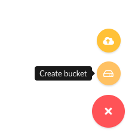

# Hive connector over MinIO file storage

## Introduction 
If you are new to Trino or Presto®, I recommend that you check out the following
blog to get a sense for the Hive connector architecture. [A gentle
 introduction to the Hive connector](https://trino.io/blog/2020/10/20/intro-to-hive-connector.html)

## Goals
In this tutorial, you will:
 1. Learn how to run a CTAS (CREATE TABLE AS) statement in Trino.
 2. Learn the roles of the Trino runtime, metastore, and storage.
 3. Dive into the relational database that contains the Hive model and metadata
    that is stored in the Hive metstore service.
 
## Steps

### Running Services

First, you want to start the services. Make sure that you are in the 
`trino-getting-started/hive/trino-minio` directory. Now run the following
command:

```
docker-compose up -d
```

You should expect to see the following output (you may also have to download
the Docker images before you see the "done" message):

```
Creating network "trino-minio_trino-network" with driver "bridge"
Creating volume "trino-minio_minio-data" with local driver
Creating minio                          ... done
Creating trino-minio_trino-coordinator_1 ... done
Creating trino-minio_mariadb_1           ... done
Creating trino-minio_hive-metastore_1    ... done
```

### Open Trino CLI

Once this is complete, you can log into the Trino coordinator node. We will
do this by using the [`exec`](https://docs.docker.com/engine/reference/commandline/exec/)
command and run the `trino` CLI executable as the command we run on that
container. Notice the container id is `trino-minio_trino-coordinator_1` so the
command you will run is:

```
docker container exec -it trino-minio_trino-coordinator_1 trino
```

When you start this step, you should see the `trino` cursor once the startup
is complete. It should look like this when it is done:
```
trino>
```
 
The first step to understanding the Hive metastore's role in the Hive
connector is to run a CTAS (CREATE TABLE AS) query that pushes data from one of
the TPC connectors into the hive catalog that points to MinIO. The TPC
connectors generate data on the fly so that we can run simple tests like this.

First, run a command to show the catalogs to see the `tpch` and `minio` catalogs
since these are what we will use in the CTAS query.

```
SHOW CATALOGS;
```

You should see that the minio catalog is registered. This is actually a Hive
connector configured under the name `minio` to delineate the underlying storage
we are using.

### Create Bucket in MinIO

If we look at the Trino Architecture, we're first going to prep the file storage
where the actual data will reside. In earlier iterations of big data systems,
this layer was commonly HDFS or other S3 compatible storage and AWS S3. For our
example, we're using MinIO which is also S3 compatible. Creating a bucket gives
us a location to write our data to and we can tell Trino where to find it.


Now, open the [MinIO UI](http://localhost:9000) and log in using:

Access Key: minio

Secret Key: minio123


Upon logging in, you will see the following screen. 


Create a Bucket by clicking (+) button and create bucket.



Name the bucket `tiny` as the dataset we will be transferring will be small.


### Querying Trino

Now that we've set up the MinIO bucket, lets move to creating our SCHEMA that
points us to the bucket in MinIO and then run our CTAS query. When we create a
table using CTAS, we're telling the table to copy the table schema and the
data from the source table into the table we're creating. This will make more
sense when you see the query below.

Note: There are two meanings we just used when saying the word "schema".
There is the table schema that defines columns of a table, then there is the
SCHEMA that I intentionally put in all caps that signifies the SCHEMA in the
containment hierarchy used by Trino. Trino defines a CATALOG which contains
multiple SCHEMAS, which contain multiple TABLES. In other databases like
Hive and MySQL


Back in the terminal create the minio.tiny SCHEMA. This will be the first call
to the metastore to save the location of the S3 schema location in MinIO.

```
CREATE SCHEMA minio.tiny
WITH (location = 's3a://tiny/');
```

Now that we have a SCHEMA that references the bucket where we store our tables 
in MinIO, we now can create our first table.

Optional: To view your queries run, log into the 
[Trino UI](http://localhost:8080) and log in using any username (it doesn't
 matter since no security is set up).

Move the customer data from the tiny generated tpch data into MinIO uing a CTAS
query. Run the following query and if you like, watch it running on the Trino UI:

```
CREATE TABLE minio.tiny.customer
WITH (
    format = 'ORC',
    external_location = 's3a://tiny/customer/'
) 
AS SELECT * FROM tpch.tiny.customer;
```

Go back to the [MinIO UI](http://localhost:9000), and click under the tiny 
bucket. You will now see a `customer` directory generated from that table and
underneath that directory will be a file with a name comprised of uuid and date.
This is the orc file generated by the trino runtime residing in MinIO.

Now there is a table under MinIO, you can query this data by checking the
following.
```
SELECT * FROM minio.tiny.customer LIMIT 50;
```

So the question now is how does Trino know where to find the orc file residing
in MinIO when all we specify is the catalog, schema, and table? How does Trino
know what columns exist in the orc file, and even the file it is retrieving
is an orc file to being with? Find out more in the next step.

### Exploring the Hive Metastore


In order for Trino to know where to locate this file, it uses the Hive
metastore to manage and store this information or metadata in a relational
database that the metastore points to, in this case our `mariadb` instance.
Execute the following statement to log into the `mariadb` instance and follow
the remaining commands to learn how the metadata gets split into different
tables. Understanding this model will also solidify the metastore's role in the
scheme of Trino's use of it in the Hive connector.

Open another terminal and run the following command:

```
docker container exec -it "trino-minio_mariadb_1" /bin/bash
```

Once you see the `root@mariadb` terminal, enter into the cli.

```
mysql -uroot -p"$MYSQL_ROOT_PASSWORD"
```

Now that you're in the metastore's database command line interface, you can run 
SQL commands on this database to see where the metadata is stored. First, let's
look at the databases stored in the metastore.

```
SELECT
 DB_ID,
 DB_LOCATION_URI,
 NAME, 
 OWNER_NAME,
 OWNER_TYPE,
 CTLG_NAME
FROM metastore_db.DBS;
```

```
+-------+---------------------------+---------+------------+------------+-----------+
| DB_ID | DB_LOCATION_URI           | NAME    | OWNER_NAME | OWNER_TYPE | CTLG_NAME |
+-------+---------------------------+---------+------------+------------+-----------+
|     1 | file:/user/hive/warehouse | default | public     | ROLE       | hive      |
|     2 | s3a://tiny/               | tiny    | trino      | USER       | hive      |
+-------+---------------------------+---------+------------+------------+-----------+
```
This shows the databases. What may be strange at first glance, is this is
showing the schema that we created under the database table. This is because
the Hive metastore has two abstractions for its metadata, databases and tables.
Since Trino follows the traditional 3 level ANSI SQL catalog standard, schema
is equivalent to a database. So just as a database contains multiple tables,
a schema will contain multiple tables. Notice the `DB_LOCATION_URI` is in the
bucket location created before in MinIO and set when you created this schema. 
The owner is the `trino` user coming from the user in the trino instance. Also
note the `CTLG_NAME` references the trino catalog.

The next command will show us metadata about the customer table created in the
previous step

```
SELECT 
 t.TBL_ID, 
 t.DB_ID, 
 t.OWNER, 
 t.TBL_NAME, 
 t.TBL_TYPE,
 t.SD_ID
FROM metastore_db.TBLS t 
 JOIN metastore_db.DBS d 
  ON t.DB_ID= d.DB_ID 
WHERE d.NAME = 'tiny';
```

```
+--------+-------+-------+----------+----------------+-------+
| TBL_ID | DB_ID | OWNER | TBL_NAME | TBL_TYPE       | SD_ID |
+--------+-------+-------+----------+----------------+-------+
|      1 |     2 | trino | customer | EXTERNAL_TABLE |     1 |
+--------+-------+-------+----------+----------------+-------+
```

There's nothing unexpected here. You should note that the `DB_ID` matches with
the id of the `tiny` database (ie schema) name. The owner is the same `trino`
user from our trino instance. The `TBL_NAME` is the name of the `customer`
table created in the last step. 

You may notice the location for the table seems to be missing but that
information is actually on another table. The next query will show this
location. Take note of the `SD_ID` before running the next query.

```
SELECT 
 s.SD_ID,
 s.INPUT_FORMAT,
 s.LOCATION,
 s.SERDE_ID 
FROM metastore_db.TBLS t 
 JOIN metastore_db.DBS d
  ON t.DB_ID = d.DB_ID
 JOIN metastore_db.SDS s 
  ON t.SD_ID = s.SD_ID
WHERE t.TBL_NAME = 'customer'
 AND d.NAME='tiny';
```

```
+-------+-------------------------------------------------+---------------------+----------+
| SD_ID | INPUT_FORMAT                                    | LOCATION            | SERDE_ID |
+-------+-------------------------------------------------+---------------------+----------+
|     1 | org.apache.hadoop.hive.ql.io.orc.OrcInputFormat | s3a://tiny/customer |        1 |
+-------+-------------------------------------------------+---------------------+----------+
```

This table should contain a row that matches the `SD_ID` from the last query
result. You should also see the expected `INPUT_FORMAT` class which since we
specified we were storing orc files it should be the `OrcInputFormat`. Also
notice the `LOCATION` is the schema location we set. If we hadn't set this it
would have defaulted to `<schema_url>/<table_name>`. Then there is the
`SERDE_ID`. SerDe is an abbreviation for serializer/deserializer. This will
point us to another table that contains the information to find which serializer
to use when parsing the file in MinIO.

To find out the serializer used, run the following query:
```
SELECT 
 sd.SERDE_ID,
 sd.NAME,
 sd.SLIB
FROM metastore_db.TBLS t 
 JOIN metastore_db.DBS d
  ON t.DB_ID = d.DB_ID
 JOIN metastore_db.SDS s 
  ON t.SD_ID = s.SD_ID
 JOIN metastore_db.SERDES sd 
  ON s.SERDE_ID = sd.SERDE_ID
WHERE t.TBL_NAME = 'customer'
 AND d.NAME='tiny';
```

```
+----------+----------+-------------------------------------------+
| SERDE_ID | NAME     | SLIB                                      |
+----------+----------+-------------------------------------------+
|        1 | customer | org.apache.hadoop.hive.ql.io.orc.OrcSerde |
+----------+----------+-------------------------------------------+
```

This is a pretty simple table, you will notice the `NAME` refers to the table
the serializer is used for, and `SLIB` is the serializer library used when
parsing the file in MinIO.

Our last metadata query is looking at the columns on the table.

```
SELECT c.* 
FROM metastore_db.TBLS t
 JOIN metastore_db.DBS d
  ON t.DB_ID = d.DB_ID
 JOIN metastore_db.SDS s
  ON t.SD_ID = s.SD_ID
 JOIN metastore_db.COLUMNS_V2 c
  ON s.CD_ID = c.CD_ID
WHERE t.TBL_NAME = 'customer'
 AND d.NAME='tiny'
ORDER by CD_ID, INTEGER_IDX;
```

```
+-------+---------+-------------+--------------+-------------+
| CD_ID | COMMENT | COLUMN_NAME | TYPE_NAME    | INTEGER_IDX |
+-------+---------+-------------+--------------+-------------+
|     1 | NULL    | custkey     | bigint       |           0 |
|     1 | NULL    | name        | varchar(25)  |           1 |
|     1 | NULL    | address     | varchar(40)  |           2 |
|     1 | NULL    | nationkey   | bigint       |           3 |
|     1 | NULL    | phone       | varchar(15)  |           4 |
|     1 | NULL    | acctbal     | double       |           5 |
|     1 | NULL    | mktsegment  | varchar(10)  |           6 |
|     1 | NULL    | comment     | varchar(117) |           7 |
+-------+---------+-------------+--------------+-------------+
```

You'll notice that the `COLUMNS_V2` table has a foreign key `CD_ID` to the
`SDS` storage table. Each key will correlate to a specific table and so you'll
see that the columns are for the `customer` table. You can now notice the
`COLUMN_NAME`, `TYPE_NAME`, and the order these fields are expected in the
`INTEGERD_IDX`.

So now you have a working understanding of the Hive metastore and the model
it uses to store metadata about the files that are generated and written to
when inserting using the Hive connector. 

### Stopping Services

Once you complete this tutorial, the resources used for this excercise can be released
by runnning the following command:

```
docker-compose down
```


See trademark and other [legal notices](https://trino.io/legal.html).
